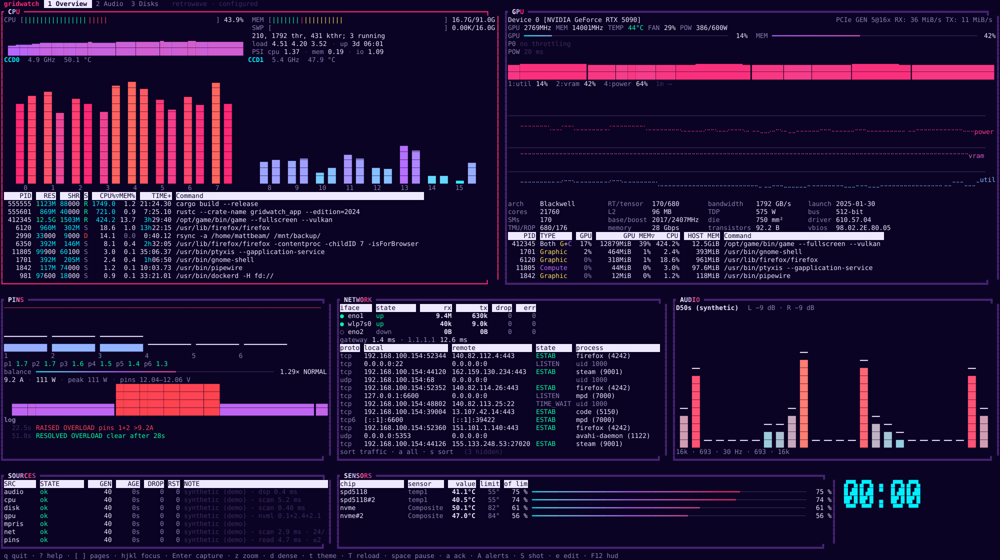

# gridwatch

A modular, themeable ops dashboard for the terminal — a grid of components that each render from a 1x1 tile to full screen, in themes like `retrowave` and `modern`, reproducing the behaviour of htop, nvtop and [astral-watch](https://github.com/mbeaman/astral-watch) alongside network, audio-visualizer and Winamp-style now-playing tiles. Rust + ratatui 0.30, built for a single Linux workstation first.

**Status:** arc 1 (`v0.1.0`) — the grid lights up — and arc 2 (`v0.2.0`, untagged): the core seam, the 12×6 layout engine, three themes, the cpu source with htop's meters, CCD core bars and the top-N process table, **the gpu source over NVML with nvtop's header, ten-minute charts and GPU process table**, journal record/replay, CI-regenerated screenshots — and arc 3: **the astral-watch pins tile with the cross-page alert banner**, hot reload of the config files and themes, the theme loader v2 with `terminal` and `phosphor-green`, `STALE` badges and `gridwatch doctor`. Network, audio and Winamp follow (see [`docs/ROADMAP.md`](docs/ROADMAP.md)).

[](docs/img/overview-retrowave.svg)

*Regenerated by CI from `gridwatch shot --format svg` (synthetic data, seeded, byte-deterministic): [modern](docs/img/overview-modern.svg) · [phosphor-green](docs/img/overview-phosphor-green.svg) · [120×40 dense](docs/img/dense-120x40.svg). At 131×37 the same page reads as:*

```
 gridwatch  1 Overview  2 Audio   retrowave · configured
┏ CPU ━━━━━━━━━━━━━━━━━━━━━━━━━━━━━━━━━━━━━━━━━━━━━━━━━━━━━━━━━━┓ ╔ GPU ══════════════════════════════════════════════════════════╗
┃CPU [||||||||||||||||||||||                             ] 43.9%┃ ║Device 0 [GeForce R…]  PCIe GEN 5@16x RX: 36 MiB/s TX: 11 MiB/s║
┃MEM [|||||||||||||||||||                          ] 16.7G/91.0G┃ ║GPU 2769MHz MEM 14001MHz TEMP 44°C FAN 29% POW 386/600W        ║
┃SWP [                                             ] 0.00K/16.0G┃ ║GPU ━━━─────────────────── 14%  MEM ━━━━━━━━━━───────────── 42%║
┃210, 1792 thr, 431 kthr; 3 running · load 4.51 4.20 3.52       ┃ ║ENC ─────────────────────── 0%  DEC ──────────────────────── 0%║
┃CCD0  4.9 GHz  61.8 °C         CCD1  5.4 GHz  53.6 °C          ┃ ║POW 20 ms                                                      ║
┃                                                               ┃ ║                                                               ║
┃   ▁      ▄ ▆▃       ▆                                         ┃ ║             ▇███████▇▇▇▇▇▇▇▇▇▇▇█████▇▇▇▇▇▇▇▇▇▇▇█████▇▇▇▇▇▇▇▇▇▇║
┃▃▇ █  ▅▃  █ ██ ▅  ▇▂ █▂                                        ┃ ║             ██████████████████████████████████████████████████║
┃██ █▆ ██ ▇█ ██ ██ ██ ██                                        ┃ ║1:util 14%  2:vram 42%  4:power 64%  1m ⟶                      ║
┃██ ██ ██ ██ ██ ██ ██ ██                                        ┃ ║                                                               ║
┃██ ██ ██ ██ ██ ██ ██ ██                       ▄▂               ┃ ║                                                               ║
┃██ ██ ██ ██ ██ ██ ██ ██        ▄▅ ▄▅    ▇▆    ██     ▃         ┃ ║ ⠉⠉⠉⠉⠉⠉⠉⠉⠉⠉⠉⠉⠉⠉⠉⠉⠉⠉⠒⠒⠉⠑⠒⠒⠊⠉⠒⠊⠉⠑⠒⠒⠒⠉⠑⠒⠒⠒⠒⠒⠒⠒⠒⠒⠒⠒⠒⠒⠒⠒⠒⠊⠉⠑⠒⠉⠉⠉⠒⠊⠉ ║
┃██ ██ ██ ██ ██ ██ ██ ██        ██ ██ ▆█ ██ ██ ██ ▄▄ ▁█         ┃ ║ ⠒⠒⠒⠒⠒⠒⠒⠒⠒⠒⠒⠒⠒⠒⠒⠒⠒⠒⠒⠒⠒⠒⠒⠒⠒⠒⠒⠒⠒⠒⠒⠒⠒⠒⠒⠒⠒⠒⠒⠒⠒⠒⠒⠒⠒⠒⠒⠒⠒⠒⠒⠒⠒⠒⠒⠒⠒⠒⠒⠒⠒ ║
┃0  1  2  3  4  5  6  7         8  9  10 11 12 13 14 15         ┃ ║      ⢀⣀     ⣀⣀⣀                                               ║
┃PSI cpu 1.37 · mem 0.19 · io 1.09                              ┃ ║ ⠉⠉⠉⠉⠉⠁ ⠉⠉⠉⠉⠉   ⠉⠉⠉⠉⠉⠉⠉⠉⠉⠉⠉⠉⠉⠉⠉⠉⠉⠉⠉⠉⠉⠉⠉⠉⠉⠉⠉⠉⠉⠉⠉⠉⠉⠉⠉⠉⠉⠉⠉⠉⠉⠉⠉⠉⠉⠉ ║
┗━━━━━━━━━━━━━━━━━━━━━━━━━━━━━━━━━━━━━━━━━━━━━━━━━━━━━━━━━━━━━━━┛ ╚═══════════════════════════════════════════════════════════════╝

╔ PINS ═══════════════════════════════════╗ ╔ NET ════════════════════════════════════╗ ╔ AUDIO ══════════════════════════════════╗
║                                         ║ ║                                         ║ ║                                         ║
║                                         ║ ║                                         ║ ║                                         ║
║                                         ║ ║                                         ║ ║                                         ║
║                                         ║ ║                                         ║ ║                                         ║
║ ▪ pins                                  ║ ║ ▪ net                                   ║ ║ ▪ audio                                 ║
║ arrives in a later arc                  ║ ║ arrives in a later arc                  ║ ║ arrives in a later arc                  ║
║                                         ║ ║                                         ║ ║                                         ║
║                                         ║ ║                                         ║ ║                                         ║
║                                         ║ ║                                         ║ ║                                         ║
╚═════════════════════════════════════════╝ ╚═════════════════════════════════════════╝ ╚═════════════════════════════════════════╝

╔ SOURCES ════════════════════════════════╗ ╔ SENSORS ══════════════════════════════════════════════════════╗
║cpu ok                                   ║ ║                                                               ║  00:00
║gpu ok                                   ║ ║ ▪ sensors                                                     ║
║                                         ║ ║ arrives in a later arc                                        ║
╚═════════════════════════════════════════╝ ╚═══════════════════════════════════════════════════════════════╝
 q quit · ? help · [ ] pages · hjkl focus · Enter capture · z zoom · d dense · t theme · T reload · space pause · a ack · A alerts · S shot · F12 hud
```

*`gridwatch shot --format ansi --size 131x37 --theme retrowave`, colour stripped for this page — the real frame is a truecolor synthwave palette with gradient-coloured core bars and braille chart lines; at 131 columns both 6x3 tiles are one row short of their process tables, which the SVGs above show. A PNG from a real Ptyxis window still needs a human.*

## Run it

```sh
cargo run --release                 # live: the Overview against this machine
cargo run --release -- run --demo   # synthetic data, no hardware needed
cargo run --release -- shot --format ansi --size 250x70 --theme retrowave
cargo run --release -- run --record session.jsonl      # journal every message (tables off; --tables on, --record-input)
cargo run --release -- run --replay session.jsonl --speed 4   # replay it; nothing downstream can tell
cargo run --release -- shot --replay session.jsonl --at 30 --format svg > frame.svg
cargo run --release -- keys                                  # the metric catalogue (docs/KEYS.md)
cargo run --release -- component list                        # every component's tiers (docs/COMPONENTS.md)
cargo run --release -- config default > ~/.config/gridwatch/config.toml
cargo run --release -- doctor       # every capability with a reason and a fix (+ the live probes; --offline skips them)
cargo run --release -- config check --theme phosphor-green   # the two files, then the theme's warnings and WCAG contrast report
```

Keys: `1`–`9` pages, `Tab`/`hjkl` focus, `Enter` capture (then, in the cpu and gpu tiles,
`↑/↓ PgUp/PgDn Home/End` select, `<`/`>`/`F6` sort, `I` invert; in the gpu tile `1`–`6`
toggle chart series and `r` reverses them; in the pins tile `p` freezes, `r` resets
peaks, `+`/`-` change the interval), `a` ack the alert banner, `A` alerts, `z` zoom, `d` dense,
`t` cycle theme, `T` reload theme, `space` pause, `r` pause/resume a `--record`, `e` edit the layout (`HJKL` move, `Ctrl-hjkl` resize, `s` footprint, `S`+dir swap, `a` add, `x` remove, `u`/`Ctrl-r` undo, `w` save `layout.toml`, drag with the mouse), `F12` stats HUD, `?` help,
`q` (or `Ctrl-q`) quit.

## What is here today

- **`htop` tile** — htop 3.4.1's meters with its formulas verbatim (guest
  subtracted, `cached = Cached + SReclaimable − Shmem`, iowait counted as idle),
  32 gradient core bars grouped into real CCD blocks from sysfs `die_id`, per-CCD
  frequency and `Tccd` temperature, load, tasks and PSI — from an 8×3 chip to a
  full screen. Parity is tracked row by row in [`docs/PARITY.md`](docs/PARITY.md).
- **`gpu` tile** — nvtop 3.2.0's header (`Device 0 [name] PCIe GEN 5@16x RX/TX`,
  clocks, temperature, fan, power against the limit, GPU/MEM/ENC/DEC bars), a
  20 ms board-power trace, ten-minute braille charts of util / VRAM / temperature /
  power / clock / effective load, the GPU-Z spec column, and nvtop's process table
  joined with the cpu scan (`PID TYPE GPU GPU MEM CPU HOST MEM Command`) — over
  nvml-wrapper on its own thread, ≈ 4.3 ms of NVML time per second with the
  table on, never `pcie_throughput`, never a GPU client itself. Falls back to
  `nvidia-smi` when the library will not load.
- **`pins` tile** — astral-watch's per-pin 12V-2x6 amperage over its own
  library (exporter or direct i2c, auto-selected): six bars with peak caps and
  the 9.2 A limit line, the balance gauge, the watts trend, the alert log and
  a device header from the gpu source; astral-watch's `Lifecycle` debounces
  and its overload/disconnect/imbalance alerts raise a **banner on every page**
  (`a` acknowledges, `A` opens the log). Thresholds come from astral-watch's
  own config file, so what gridwatch shows is what the service would send.
- **`alerts`, `clock` and `sources` tiles**, the second of which shows every source's
  state, generation, age, drops and restarts.
- **Themes** `retrowave`, `modern`, `mono` — components never name a colour.

## Where to read next

- [`docs/PLAN.md`](docs/PLAN.md) — the call, decisions, arc table
- [`docs/ARCHITECTURE.md`](docs/ARCHITECTURE.md) — the design and its contracts
- [`docs/ROADMAP.md`](docs/ROADMAP.md) — arcs, deliverables, acceptance
- [`docs/PERFORMANCE.md`](docs/PERFORMANCE.md) — the ceilings and what was measured
- [`docs/PARITY.md`](docs/PARITY.md) · [`docs/THEMES.md`](docs/THEMES.md) — tool parity and glyph support
- [`docs/WORKSPACE.md`](docs/WORKSPACE.md) — crate layout and dependencies
- [`docs/DECISIONS.md`](docs/DECISIONS.md) — decision log
- [`docs/MACHINE.md`](docs/MACHINE.md) — the machine it is built against

MIT licensed.
