# The tiles

Eleven of them. Every tile renders from an 8x3 chip up to the whole screen, and
picks how much to show from the room it actually has — the pictures below are
each tile alone on the grid at 160x44, which is roughly what a quarter-screen
tile looks like on a large monitor.

> The **tier ladder** for each tile — what it adds at each size, and the minimum
> it needs — is generated from the binary into
> [`docs/COMPONENTS.md`](../docs/COMPONENTS.md). Every metric it can draw is in
> [`docs/KEYS.md`](../docs/KEYS.md). This page is about what the numbers *mean*.

## The big three

### CPU — [full page](Tiles-CPU.md)

[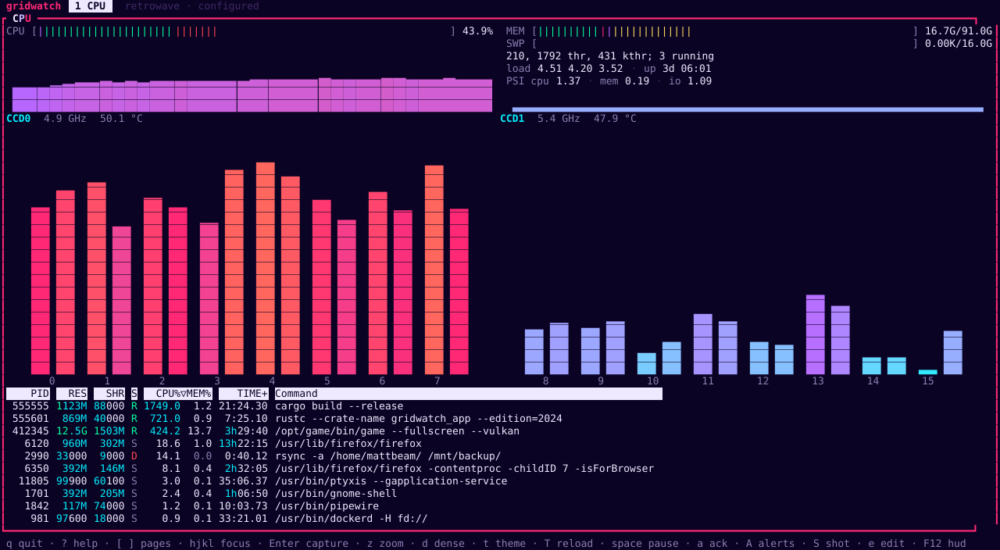](../docs/img/wiki/tile-htop.svg)

htop 3.4.1, with its formulas rather than an approximation of them: guest time
subtracted, `cached = Cached + SReclaimable − Shmem`, Irix-mode CPU%. Cores are
grouped into the **real CCD blocks** your CPU has, read from sysfs, with each
die's frequency and temperature beside it. Zoom it and you get the full
interactive table — search, filter, tree, tags — and kill, renice, affinity and
ioprio behind a confirm line.

### GPU — [full page](Tiles-GPU.md)

[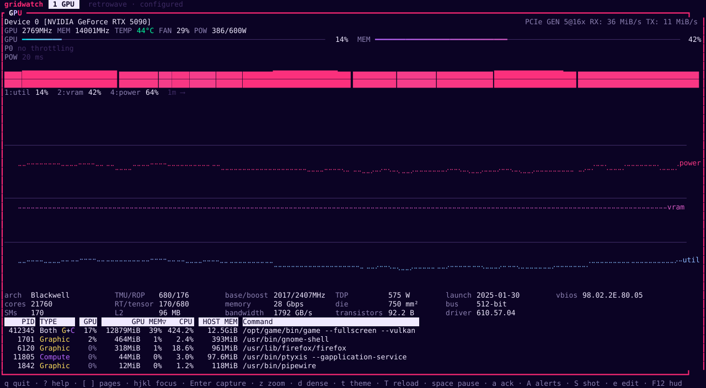](../docs/img/wiki/tile-gpu.svg)

nvtop 3.2.0's header over NVML, plus a 20 ms board-power trace and ten-minute
charts of utilisation, VRAM, temperature, power, clock and one figure nvtop does
not have. NVIDIA only.

### Disks — [full page](Tiles-Disks.md)

[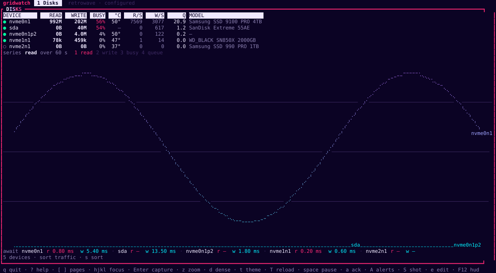](../docs/img/wiki/tile-disk.svg)

Read and write rates, IOPS, service times and each drive's temperature. The
utilisation column says **`BUSY`, not `%util`**, and the page explains why that
is not pedantry. **This tile is not in the default layout** — see
[Configuring](Configuring.md#adding-the-disks-tile).

## The rest

### 12V-2x6 pins

[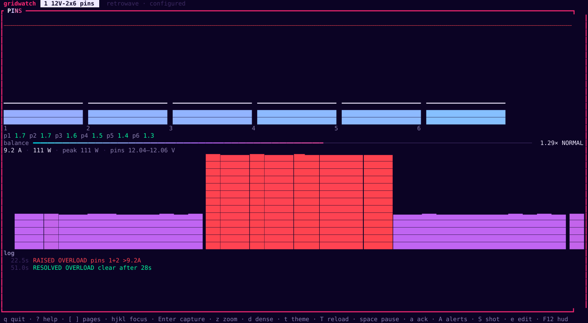](../docs/img/wiki/tile-pins.svg)

Per-pin amperage on a 12V-2x6 connector, through
[astral-watch](https://github.com/mbeaman/astral-watch)'s own library. Six bars
with peak caps against the 9.2 A limit, a **balance gauge** — the ratio of the
hottest pin to the coldest, which is what actually predicts a melted connector —
the watts trend and the alert log. Its overload alerts raise a banner on every
page, using astral-watch's own thresholds, so what you see is what the service
would send.

### Network

[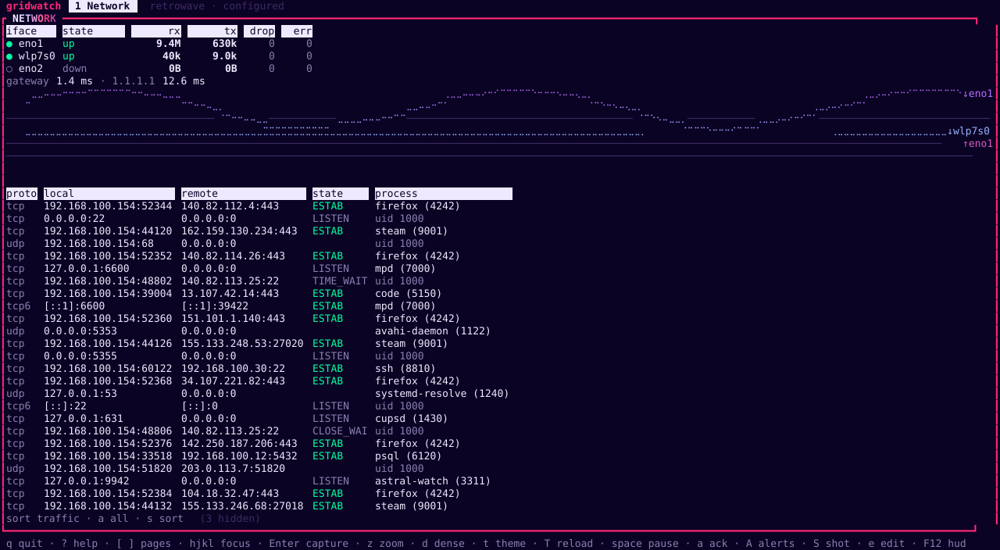](../docs/img/wiki/tile-net.svg)

Every interface's rates and link state, the default route and resolvers, latency
probes over an **unprivileged** ICMP socket (no `sudo`, no `CAP_NET_RAW`), and
the connection table with the process behind each socket where the kernel lets a
normal user see it. The rx/tx chart is mirrored about a zero line: receive above,
transmit below.

### Sensors

[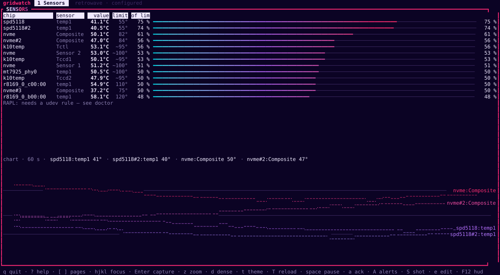](../docs/img/wiki/tile-sensors.svg)

Every hwmon chip on the machine, hottest first, against **that chip's own**
warn and critical thresholds rather than a number someone picked. Package power
from RAPL where the kernel lets you read it, and the GPU's row joined in.

### Audio

[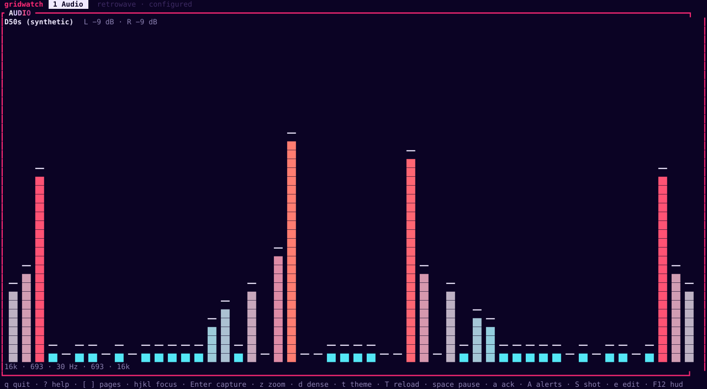](../docs/img/wiki/tile-audio.svg)

The default sink's monitor through a supervised `pw-record` child: a cava-style
dual-FFT spectrum with Winamp or cava ballistics, an oscilloscope and a stereo
VU. It animates **only while there is sound**, and kills the capture child ten
seconds after you look away — so an idle visualizer costs nothing.

### Now playing

[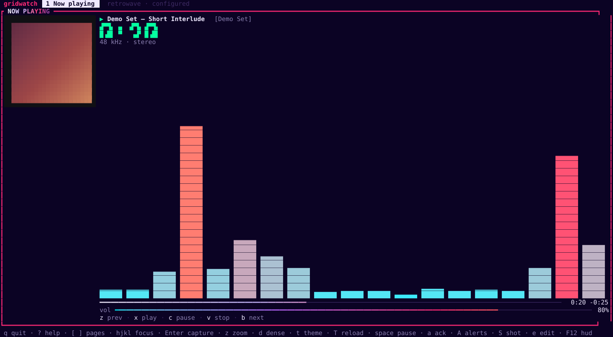](../docs/img/wiki/tile-winamp.svg)

Whatever is on MPRIS, in classic-skin form: scrolling marquee, big elapsed
digits, transport row, album art painted as half-blocks, and the spectrum
borrowed from the audio source. Firefox counts as a player.

### Alerts

[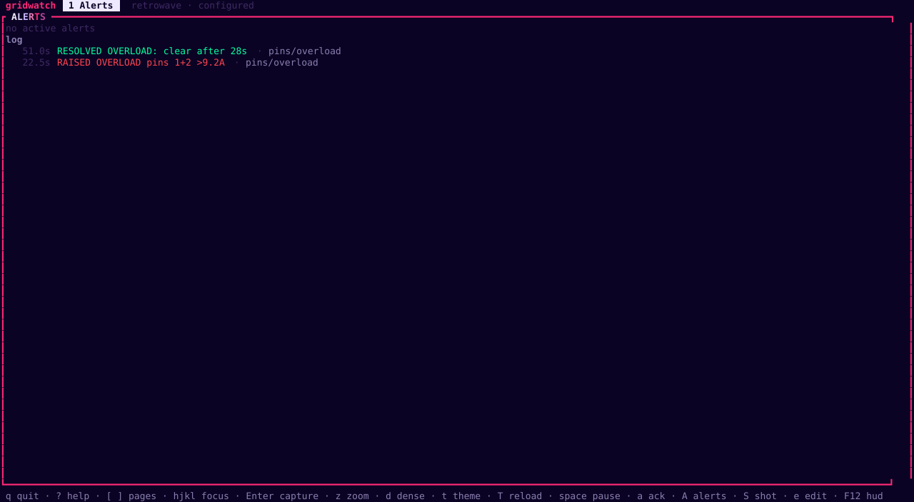](../docs/img/wiki/tile-alerts.svg)

Active alerts worst-first and the event log beneath. Alerts come from two
places: astral-watch's own pin conditions, and any `[[rules]]` you write — where
a rule can compare one metric against **another metric**, not just a constant.

### Sources

[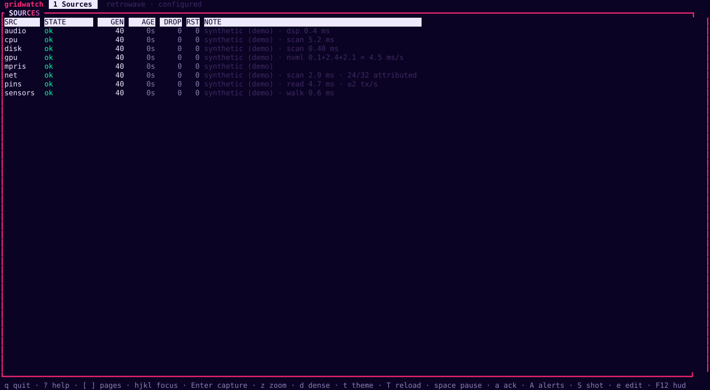](../docs/img/wiki/tile-sources.svg)

The health of everything feeding the dashboard: each source's state, how many
batches it has published, how old its newest sample is, what it has dropped and
how often it has restarted. This is the tile you look at when a number stops
moving.

### Clock

[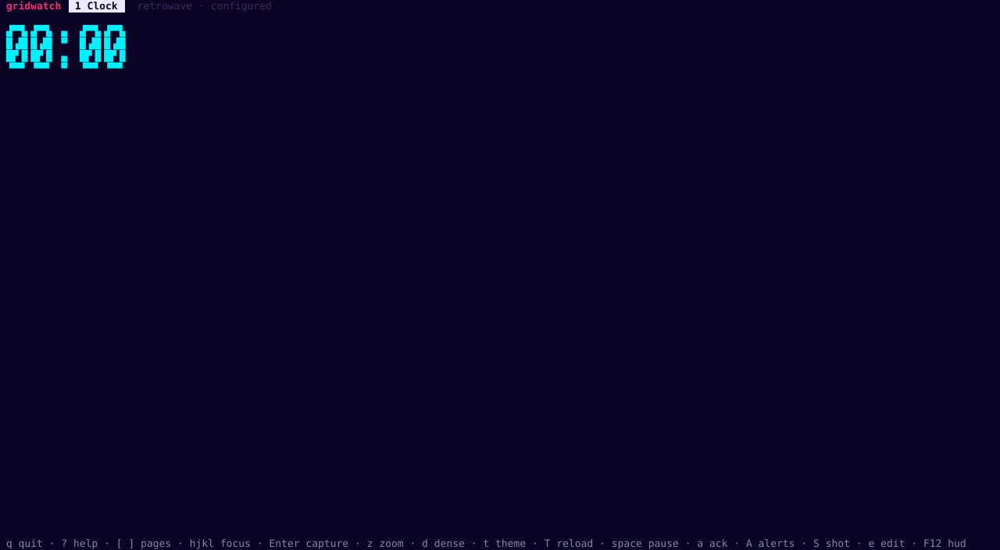](../docs/img/wiki/tile-clock.svg)

The time, in whatever size you give it.
